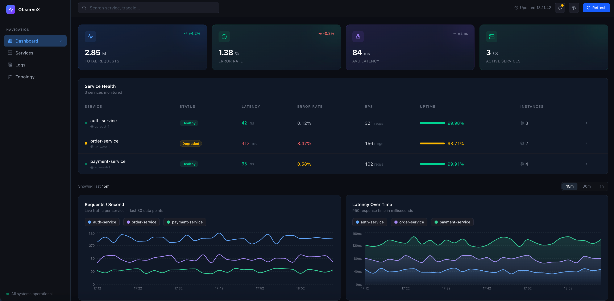

# ObserveX — Microservice Monitoring Dashboard

A production-style observability dashboard built with React + Tailwind CSS, inspired by Grafana and Datadog.

**Live demo → [microservice-monitoring-ui.vercel.app](https://microservice-monitoring-ui.vercel.app)**



## Features

- **KPI Cards** — total requests, error rate, avg latency, active services
- **Service Health Table** — expandable rows with version, region, instance details
- **Alert System** — bell icon shows live warnings/criticals based on latency, error rate and uptime thresholds
- **Live Charts** — requests/second (line) and latency over time (area) with per-service toggle
- **Log Explorer** — filterable log stream by level (INFO / WARN / ERROR / DEBUG) with search
- **Services Page** — expanded per-service cards with uptime bar and instance details
- **Search** — filters service table and logs simultaneously
- **Auto-refresh** — polls the API every 15 seconds when connected to a real backend

## Tech Stack

- [React 19](https://react.dev) + [Vite](https://vite.dev)
- [Tailwind CSS v4](https://tailwindcss.com)
- [Recharts](https://recharts.org) — charts
- [Lucide React](https://lucide.dev) — icons

## Getting Started

```bash
npm install
npm run dev
```

Open [http://localhost:5173](http://localhost:5173).

The app runs with **mock data by default** — no backend required.

## Connecting a Real Backend

Set `USE_MOCK = false` in [`src/App.jsx`](src/App.jsx) and point the app at your aggregator API:

```bash
# .env.local
VITE_API_BASE=http://localhost:4000
```

The data hook in [`src/hooks/useDashboardData.js`](src/hooks/useDashboardData.js) fetches these endpoints:

| Endpoint | Description |
|---|---|
| `GET /api/kpis` | Aggregate KPI numbers |
| `GET /api/services` | Service health array |
| `GET /api/metrics/rps?window=30m` | Time-series RPS per service |
| `GET /api/metrics/latency?window=30m` | Time-series latency per service |
| `GET /api/logs?limit=200` | Recent log entries |

See [`src/data/mockData.js`](src/data/mockData.js) for the exact shapes each endpoint should return.

## Project Structure

```
src/
  App.jsx                        # Root — owns page state, data source switch
  hooks/
    useDashboardData.js          # Fetches all endpoints, polls every 15s
  data/
    mockData.js                  # Mock time-series, services, logs
  components/
    layout/
      Sidebar.jsx                # Nav sidebar
      Topbar.jsx                 # Search + alert bell + refresh
    dashboard/
      KPICard.jsx                # Single metric card
      ServiceTable.jsx           # Health table with expandable rows
      RequestChart.jsx           # Recharts line chart with service toggle
      LatencyChart.jsx           # Recharts area chart with service toggle
      LogsPanel.jsx              # Filterable log stream
  pages/
    Dashboard.jsx                # Main dashboard layout
    Services.jsx                 # Expanded service cards
    Logs.jsx                     # Full-page log explorer
```

## Services (Mock)

| Service | Status | Region |
|---|---|---|
| auth-service | Healthy | us-east-1 |
| order-service | Degraded | us-west-2 |
| payment-service | Healthy | eu-west-1 |
